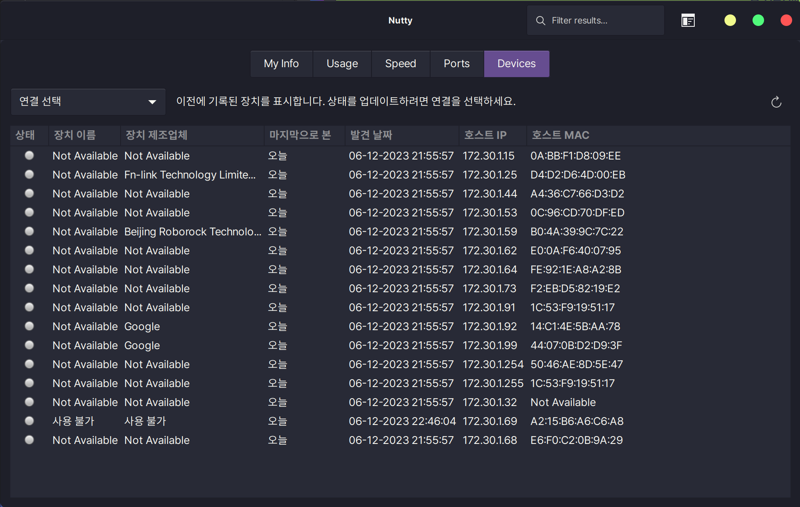

# Nutty

GUI 네트워크 유틸리티 Nutty

주요 기능

- 로컬 네트워크의 연결된 장치 확인
- 네트워크 사용량 확인
- 네트워크 속도 체크
- 포트 점검

* upstream : https://babluboy.github.io/nutty/

Nutty는 리눅스 사용자를 위한 네트워크 유틸리티입니다. 이 프로그램의 주요 기능은 다음과 같습니다:

Devices 탭: 네트워크에서 발견된 장치들의 목록을 표 형식으로 보여줍니다. 사용자는 장치의 호스트 이름과 제조사 이름을 편집할 수 있으며, 스캔 시 발견된 장치들을 실시간으로 확인할 수 있습니다​​.

Usage 탭: Nutty가 설치된 장치의 대역폭과 관련된 두 가지 주요 정보를 제공합니다. 상단 섹션에서는 현재 날짜, 어제, 현재 월, 지난 월의 데이터 송수신량을 보여주며, 하단 섹션에서는 현재 실행 중인 애플리케이션과 해당 애플리케이션의 데이터 송수신량을 보여줍니다​​.

Speed 탭: 업로드 및 다운로드 인터넷 속도와 관련된 정보를 제공합니다. 상단 섹션에서는 speedtest.net을 사용하여 기록된 업로드 및 다운로드 속도를 보여주며, 하단 섹션에서는 특정 원격 호스트 이름에 대한 트레이스루트와 세 가지 다른 패킷에 대한 네트워크 홉의 평균 시간을 보여줍니다​​.

Ports 탭: 사용 중인 포트와 해당 포트를 사용하는 프로그램들을 간단한 표 형식으로 보여줍니다​​.

My Info 탭: 선택된 네트워크 인터페이스에 대한 기본 정보를 제공합니다. NIC, 드라이버 등과 같은 더 자세한 정보는 토글 스위치를 활성화하여 확인할 수 있습니다​​.

단축키: Nutty는 두 가지 단축키를 제공합니다. Ctrl + Q는 어디에서나 Nutty를 닫을 수 있으며, Ctrl + F는 검색 바에 포커스를 맞춥니다​​.